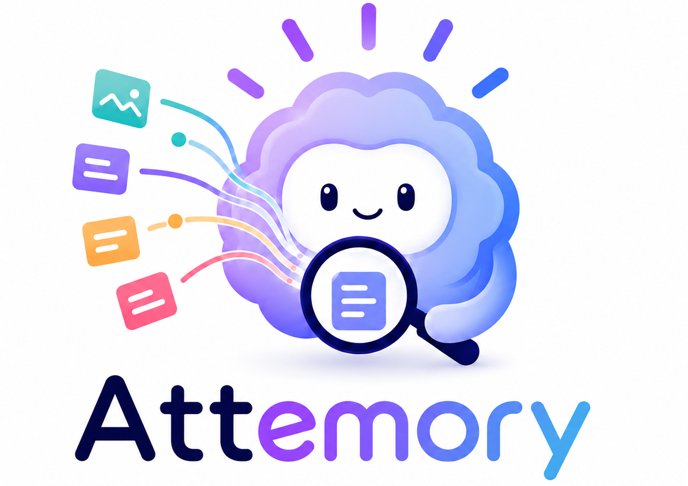

<p align="center">
  <br><b>Retrieval by attending. Search with reasoning.</b>
</p>

Attemory is an attention-native retrieval engine that turns large corpora into
model-readable memory and reusable KV cache. It retrieves by letting a model
attend directly over that memory, delivering high-recall retrieval at scale,
validated by SOTA-class results across [several benchmarks](#benchmark-results).

Because retrieval runs through the model's attention path, Attemory can find
evidence by reasoning over meaning, constraints, entities, and context, rather
than relying on keyword matching or embedding similarity alone. The same
mechanism works across conversations, documents, codebases, and long-term
memory.

Attemory makes this practical at million-token scale. With partial prefill,
KV-cache reuse, and decode-free ranking, it avoids token-by-token generation
and turns massive memory into compact, AI-agent-ready evidence sets.

## Capabilities

| Capability | What it enables |
| --- | --- |
| **Search with reasoning** | Retrieval can follow constraints, combine clues, use dates, names, and infer what memory would answer the real question. Prompts can guide Attemory toward different retrieval behaviors. |
| **Universal retrieval** | One system works for conversations, long-term memory, codebases, and any domain where LLMs work. |
| **Million-token scalability** | Million-token memories become compact evidence sets that downstream agents can actually use. |
| **Unified search** | Exact lookup, fuzzy lookup, entity relationships, and task context live in one context/query format and can be retrieved through natural language. No separate keyword, vector, and graph stack is required. |

## Benchmark Results

Attemory reaches SOTA-class results across several benchmarks with **no
benchmark-specific hacks**: no query rewrite, no summarization,
no agent-driven exploration, and no external cloud services for retrieval.
Only the raw corpus and raw benchmark query are used to run the benchmarks.

| Benchmark | What it tests | Context size | Attemory result |
| --- | --- | ---: | --- |
| **LongMemEval-S** | memory retrieval, the split most memory systems evaluate | about 40 sessions / 115k tokens | **98.72% session Recall_any@5**, **92.77% session Recall_all@5**, **98.94% message Recall_all@50** |
| **LongMemEval-M** | Million-token memory retrieval, a scale few memory systems attempt | about 500 sessions / 1.5M tokens / 5k messages | **94.89% session Recall_any@5**, **83.62% session Recall_all@5**, **92.55% message Recall_all@50** |
| **LoCoMo** | End-to-end long-conversation QA | 10 long conversations / 1,540 QA items | **94.52% accuracy** with GPT-4.1-mini as answer model and GPT-4o-mini as judge |
| **Semble** | Code retrieval | 63 repos / 19 languages / largest repo about 5M tokens | **0.9055 file-level NDCG@10** |

The LongMemEval-M message-level result is the clearest signal of Attemory's
capability: Attemory searches roughly **1.5M tokens** and **5k historical messages** per
query, then retrieves **all labeled evidence messages** within the top 50 messages
for **92.55%** of answerable queries. This is the retrieval ability the agentic
era needs: turning massive memory into compact, exact, actionable evidence.

Semble shows the same idea outside chat memory. Attemory indexes code as raw
code chunks and retrieves at chunk level, then maps evidence back to files.
On the largest repository in the run, `zig`, it searches about **5M indexed
tokens** and reaches **0.9565 file-level NDCG@10**.

All benchmarks are **reproducible in a local environment**. See
[`benchmarks/`](benchmarks/) for detailed results and run instructions.

## Technologies

Attemory retrieves through the same core mechanism that made LLMs powerful:
attention. Memories are indexed as reusable KV state, so the query can
attend over memory context and use the transformer's reasoning path to decide
what is relevant.

Partial prefill and decode-free ranking make this practical, and the prefill path is heavily
optimized for speed.
KV quantization reduces memory and storage cost, while CUDA GPU and Apple Metal
backends accelerate indexing and search on local hardware.

Under the hood, Attemory uses Qwen3.5 as the default retrieval model, with model tiers
from 0.8B (`tiny`) to 2B (`small`), 4B (`medium`), and 9B (`large`) for higher
retrieval quality.

## The New Retrieval Paradigm

Attemory treats retrieval as attention over a structured context template. The
template contains the system prompt, memory, query context, and final query; the
data to be searched is placed in the memory section, and the model retrieves by
attending over the resulting context. See
[`doc/usage.md#the-context-structure`](doc/usage.md#the-context-structure) for
the concrete structure.

While building Attemory, we found two patterns that consistently improve
retrieval quality. The first is query repetition with retrieval guidance, a
manual CoT-like way to guide the retrieval process: repeat the question in the
query context, then add instructions about what the model should focus
on before the final query. This creates a more deliberate retrieval path and
helps the model rank memories according to the user's actual constraints. The
[example](examples/weekly_diary.py) shows this pattern in practice.

The second pattern is iterative filtering for long contexts. Attemory splits large memory into segments(due to it's limited context size) and searches each
segment independently. The results from each segment are then placed back into
the same context template and filtered again. This process repeats until the
remaining results come from a single segment, which becomes the final retrieval
result.

These retrieval patterns are central to Attemory's results on LongMemEval-M and
Semble benchmarks, where it delivers SOTA-class performance on million-token
memory and large codebases. See [`benchmarks/README.md`](benchmarks/README.md)
for details.

## Getting Started

Attemory is under active development, and behavior may change between versions.
It currently supports Linux and macOS. Hardware acceleration is available on
NVIDIA CUDA and Apple Metal now.

Install Attemory:

```bash
uv pip install attemory           # macOS Apple Silicon, includes Metal runtime
uv pip install "attemory[cpu]"    # Linux CPU

# Linux CUDA
uv pip install "attemory[cuda]" \
  --extra-index-url https://attemorysystem.github.io/Attemory/whl/cu126/
```

The same install targets work with `pip`:

```bash
pip install attemory
pip install "attemory[cpu]"
pip install "attemory[cuda]" \
  --extra-index-url https://attemorysystem.github.io/Attemory/whl/cu126/
```

On macOS Apple Silicon, `attemory` automatically installs the Metal-capable
runtime, which can run both `--backend metal` and `--backend cpu`. On Linux, a
bare `attemory` install only installs the Python package; choose `cpu` or a CUDA
extra explicitly. Use `cuda-cu126` by default:

```bash
pip install "attemory[cuda]" \
  --extra-index-url https://attemorysystem.github.io/Attemory/whl/cu126/
```

If you are using a Blackwell GPU such as RTX 50 series, use `cuda-cu129` with
the CUDA 12.9 wheel index:

```bash
pip install "attemory[cuda-cu129]" \
  --extra-index-url https://attemorysystem.github.io/Attemory/whl/cu129/
```

Use `cuda-cu124` or `cuda-cu121` only when your NVIDIA driver is too old for
CUDA 12.6.

Start a local server:

```bash
attemory-server --small --backend gpu --port 9006
attemory-server --small --backend metal --port 9006
attemory-server --tiny --backend cpu --port 9006
```

Tier choice depends on hardware and quality requirements. Practical starting
points are `--tiny` for CPU or small local tests, `--small` for GPUs with about
5 GB VRAM, `--medium` for about 8 GB VRAM, and `--large` for about 12 GB VRAM.
Actual memory use also depends on context length and KV type.

Persistent session data is stored on disk. Saved segment KV cache data is stored
on disk after `save_session()` or when a session is created with
`kv_persist=True` and indexed. By default, session data uses
`$XDG_DATA_HOME/attemory/sessions` or `~/.local/share/attemory/sessions`, and KV
cache data uses `$XDG_CACHE_HOME/attemory` or `~/.cache/attemory`. Use
`ATTEMORY_DATA_DIR`, `ATTEMORY_CACHE_DIR`, or `--cache-dir` when you need
explicit storage paths.

For the full usage guide, including Python APIs, CLI commands, server options,
model tiers, context templates, and persistence, see [`doc/usage.md`](doc/usage.md).

## Example

The repository includes a small weekly diary example that shows the basic
Attemory workflow: create a session, add memories, index the session, and search
with natural language.

```bash
attemory-server --large --backend gpu --port 9006 &
python examples/weekly_diary.py
```

```python
from attemory import AttemoryClient, MemoryInput

client = AttemoryClient(host="127.0.0.1", port=9006, session_id="weekly-diary")
client.create_session()

client.add_system(
    "Read the following weekly diary entries carefully and answer the query at the end."
)

# Context lines have no id. They structure the memory without becoming returned evidence.
client.add_memory(MemoryInput(text="[Wednesday]"))

# Raw memories keep user-owned ids. Attemory returns these ids in search results.
client.add_memory(
    MemoryInput(
        id="20",
        text="In the evening, I had dinner with Clara at a Japanese restaurant.",
    )
)

client.index_session()

results = client.search(
    "Who did I have dinner with at Japanese restaurant?",
    top_k=3,
)

for result in results:
    print(result.id, result.text)
```

Example output with the large tier:

```text
== Direct fact ==
query: Who did I have dinner with at Japanese restaurant?
--- Results ---
rank=1 line=20 text=In the evening, I had dinner with Clara at a Japanese restaurant. ✓
rank=2 line=34 text=In the evening, I had dinner with Emma at a small French bistro.

== Query context: evening social activity ==
query: Who did I meet on Thursday?
query_context: The user is asking about social activities at evening.
--- Results ---
rank=1 line=27 text=In the evening, I had dinner with David at a Korean barbecue restaurant. ✓
rank=2 line=25 text=Later, I met my parents at town center, we had happy lunch together.

== Query context: family communication ==
query: Who did I meet on Thursday?
query_context: The user is asking about family activities at noon.
--- Results ---
rank=1 line=25 text=Later, I met my parents at town center, we had happy lunch together. ✓
rank=2 line=27 text=In the evening, I had dinner with David at a Korean barbecue restaurant.

== Temporal reasoning ==
query: Assume today is Thursday, who did I have dinner with yesterday?
query_context: The user's query: Assume today is Thursday, who did I have dinner with yesterday?
Resolve relative date into target date before ranking diary entries.
--- Results ---
rank=1 line=20 text=In the evening, I had dinner with Clara at a Japanese restaurant. ✓
rank=2 line=13 text=In the evening, I had dinner with Ben at an Italian place.
```

This is the core Python API: add context and memories, build the index, then
retrieve ranked memory ids and text. See [`examples/weekly_diary.py`](examples/weekly_diary.py)
for a complete runnable version.

## Build From Source

Developers building Attemory from source need a C++17 compiler, CMake 3.18 or
newer, and an attemory-core SDK.

Prebuilt `attemory-core-sdk` archives are published on the GitHub Releases
page. Download the SDK that matches your target runtime, then extract it to a
local directory:

```bash
mkdir -p 3rd/attemory-core-sdk
tar -xzf attemory-core-sdk.tar.gz -C 3rd/attemory-core-sdk --strip-components=1
```

Then pass the extracted SDK root to CMake with `ATMCORE_SDK`:

```bash
cmake -S . -B build \
  -DCMAKE_BUILD_TYPE=Release \
  -DATMCORE_SDK="$PWD/3rd/attemory-core-sdk"

cmake --build build --target attemory_server --parallel
```

Use the matching SDK archive for CUDA or macOS Metal builds, for example
`attemory-core-sdk-linux-cuda-cu126-...tar.gz` or
`attemory-core-sdk-macos-metal-...tar.gz`.

## Future Work

- [ ] MCP support for agent and tool integrations.
- [ ] Continued performance optimization for indexing, search, and native backends.
- [ ] Broader test coverage across APIs, packaging, persistence, and runtime
  variants.

## Acknowledgements

Attemory is built on the work of the [Qwen team](https://github.com/QwenLM) and
the [ggml/llama.cpp community](https://github.com/ggml-org/llama.cpp).

## Citation

If you use Attemory in research or benchmarks, please cite it as:

```bibtex
@software{attemory2026,
  title        = {Attemory: Attention-Native Memory Retrieval System},
  author       = {Lance Fang},
  year         = {2026},
  url          = {https://github.com/AttemorySystem/Attemory},
}
```

## License

Attemory is released under the MIT License. See [`LICENSE`](LICENSE).
